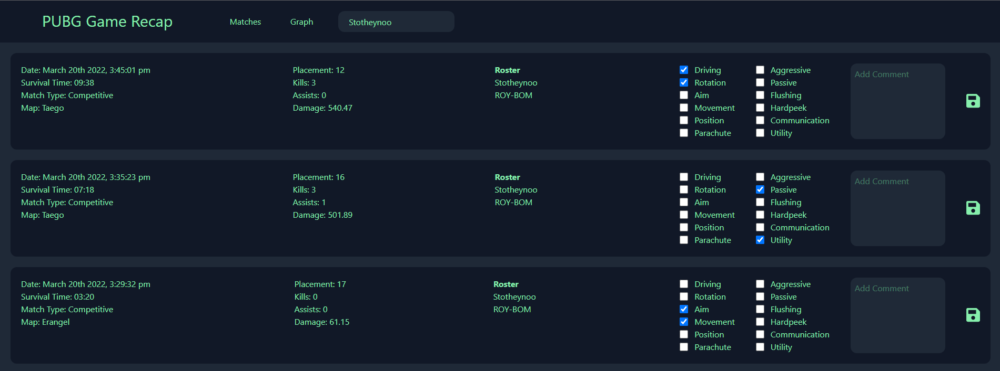
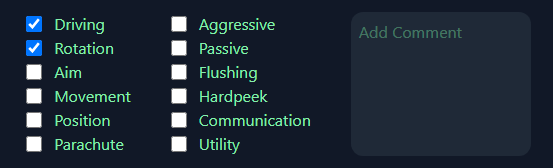
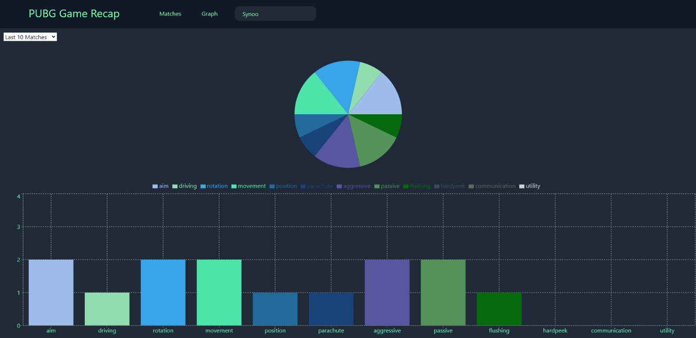

# Getting Started with Create React App

This project is made with React, Next.JS, Firebase and uses the PUBG API.

## Functionality

This project can be used to track the amount of times you made a certain mistake in the last "X" games.

In the following picture you can see how the website looks

In this picture it shows how to input your mistakes, add a comment and save them.

And here you can see the graph that the website shows after you input your mistakes. It shows the mistakes you made in the last "X" amount of games.

## Contact Information

Discord: Synoo#8796
Github: [Github](https://github.com/Synoo/pubg-game-recap)
